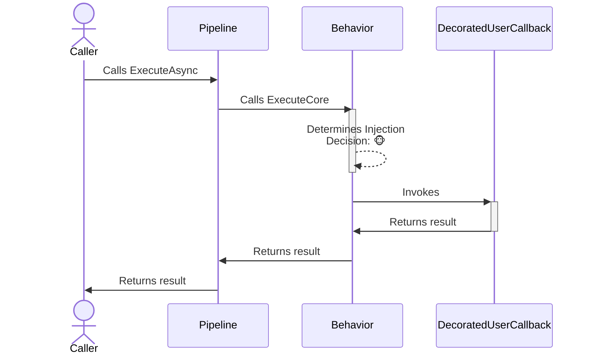
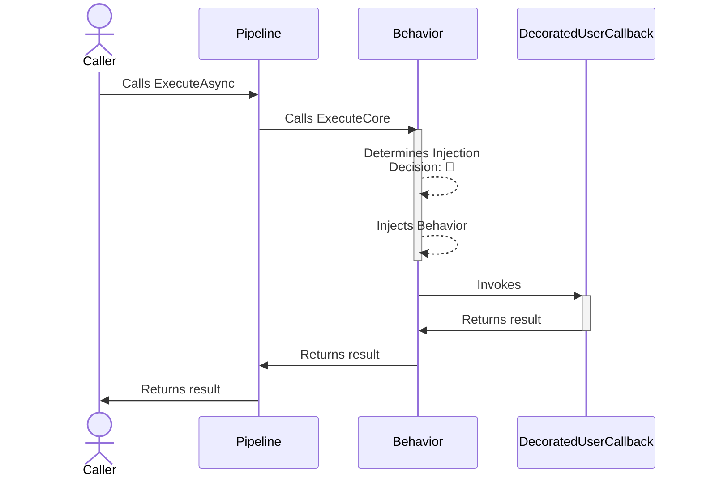

The behavior **proactive** chaos strategy is designed to inject custom behaviors into system operations right before such an operation is invoked. This strategy is flexible, allowing users to define specific behaviors such as altering the input, simulating resource exhaustion, putting the system in a given state before the actual operation is called, or other operational variations to simulate real-world scenarios.

## Configuration

- **Options**: `ChaosBehaviorStrategyOptions`
- **Extensions**: `AddChaosBehavior`

## Basic usage

Here are several ways to configure the behavior chaos strategy:

```csharp
// To use a custom delegated for injected behavior
var optionsWithBehaviorGenerator = new ChaosBehaviorStrategyOptions
{
    BehaviorGenerator = static args => RestartRedisAsync(args.Context.CancellationToken),
    InjectionRate = 0.05
};

// To get notifications when a behavior is injected
var optionsOnBehaviorInjected = new ChaosBehaviorStrategyOptions
{
    BehaviorGenerator = static args => RestartRedisAsync(args.Context.CancellationToken),
    InjectionRate = 0.05,
    OnBehaviorInjected = static args =>
    {
        Console.WriteLine("OnBehaviorInjected, Operation: {0}.", args.Context.OperationKey);
        return default;
    }
};

// Add a behavior strategy with a ChaosBehaviorStrategyOptions instance to the pipeline
new ResiliencePipelineBuilder().AddChaosBehavior(optionsWithBehaviorGenerator);
new ResiliencePipelineBuilder<HttpResponseMessage>().AddChaosBehavior(optionsOnBehaviorInjected);

// There are also a handy overload to inject the chaos easily
new ResiliencePipelineBuilder().AddChaosBehavior(0.05, RestartRedisAsync);
```

## Complete example

Here's a complete example showing behavior injection with retry:

```csharp
var pipeline = new ResiliencePipelineBuilder()
    .AddRetry(new RetryStrategyOptions
    {
        ShouldHandle = new PredicateBuilder().Handle<RedisConnectionException>(),
        BackoffType = DelayBackoffType.Exponential,
        UseJitter = true,  // Adds a random factor to the delay
        MaxRetryAttempts = 4,
        Delay = TimeSpan.FromSeconds(3),
    })
    .AddChaosBehavior(new ChaosBehaviorStrategyOptions // Chaos strategies are usually placed as the last ones in the pipeline
    {
        BehaviorGenerator = static args => RestartRedisAsync(args.Context.CancellationToken),
        InjectionRate = 0.05
    })
    .Build();
```

<Warning>
Chaos strategies should be placed **last** in the resilience pipeline. This ensures that the custom behavior is executed at the last minute, right before the actual operation is invoked.
</Warning>

## Strategy options

| Property | Default Value | Description |
|----------|---------------|-------------|
| `BehaviorGenerator` | `null` | **Required.** This delegate allows you to inject custom behavior by utilizing information that is only available at runtime. |
| `OnBehaviorInjected` | `null` | If provided then it will be invoked after the behavior injection occurred. |

## Use cases

Behavior injection is useful for:

- **Simulating resource exhaustion**: Restart services, flush caches, or simulate memory pressure before operations
- **Testing connection handling**: Close database connections or network sockets to test reconnection logic
- **Manipulating state**: Put the system in specific states to test edge cases
- **Simulating complex scenarios**: Combine multiple actions to simulate real-world failure scenarios
- **Testing cleanup logic**: Trigger cleanup operations or resource disposal to verify proper handling
- **Integration testing**: Manipulate external dependencies before operations execute

## Example scenarios

### Restart a Redis cache

```csharp
var options = new ChaosBehaviorStrategyOptions
{
    BehaviorGenerator = static args => RestartRedisAsync(args.Context.CancellationToken),
    InjectionRate = 0.02,
    OnBehaviorInjected = static args =>
    {
        Console.WriteLine($"Redis restart triggered for operation: {args.Context.OperationKey}");
        return default;
    }
};

static async ValueTask RestartRedisAsync(CancellationToken cancellationToken)
{
    // Simulate restarting Redis cache
    await RedisManager.FlushAllAsync(cancellationToken);
    await RedisManager.RestartAsync(cancellationToken);
}
```

### Clear application cache

```csharp
var options = new ChaosBehaviorStrategyOptions
{
    BehaviorGenerator = static args =>
    {
        // Clear cache before operation executes
        var cache = args.Context.Properties.GetValue(
            new ResiliencePropertyKey<IMemoryCache>("cache"), 
            null!);
        
        cache?.Clear();
        return ValueTask.CompletedTask;
    },
    InjectionRate = 0.1
};
```

### Simulate connection pool exhaustion

```csharp
var options = new ChaosBehaviorStrategyOptions
{
    BehaviorGenerator = static async args =>
    {
        // Exhaust connection pool
        var connections = new List<DbConnection>();
        try
        {
            for (int i = 0; i < 100; i++)
            {
                var conn = new SqlConnection(connectionString);
                await conn.OpenAsync(args.Context.CancellationToken);
                connections.Add(conn);
            }
            
            // Hold connections briefly
            await Task.Delay(100, args.Context.CancellationToken);
        }
        finally
        {
            foreach (var conn in connections)
            {
                await conn.DisposeAsync();
            }
        }
    },
    InjectionRate = 0.01
};
```

## Telemetry

The behavior chaos strategy reports the following telemetry events:

| Event Name | Event Severity | When? |
|------------|----------------|-------|
| `Chaos.OnBehavior` | `Information` | Just before the strategy calls the `OnBehaviorInjected` delegate |

Here are some sample events:

```
Resilience event occurred. EventName: 'Chaos.OnBehavior', Source: '(null)/(null)/Chaos.Behavior', Operation Key: '', Result: ''

Resilience event occurred. EventName: 'Chaos.OnBehavior', Source: 'MyPipeline/MyPipelineInstance/MyChaosBehaviorStrategy', Operation Key: 'MyBehaviorInjectedOperation', Result: ''
```

<Note>
The `Chaos.OnBehavior` telemetry event will be reported **only if** the behavior chaos strategy injects a custom behavior which does not throw an exception. If the behavior is either not injected or injected and throws an exception then there will be no telemetry emitted. Also, the `Result` will be **always empty** for the `Chaos.OnBehavior` telemetry event.
</Note>

## How it works

### Normal execution (no chaos)



### Chaos execution (behavior injected)



<Note>
Unlike fault or outcome injection, behavior injection does **not** prevent the user's callback from being invoked. The custom behavior is executed **before** the callback is executed.
</Note>

## Anti-patterns

### DON'T: Inject delays using behavior strategy

<Warning>
Don't use behavior strategies to inject delays. Use the latency chaos strategy instead.
</Warning>

```csharp
// ❌ Avoid this
var pipeline = new ResiliencePipelineBuilder()
    .AddChaosBehavior(new ChaosBehaviorStrategyOptions
    {
        BehaviorGenerator = static async args =>
        {
            await Task.Delay(TimeSpan.FromSeconds(7), args.Context.CancellationToken);
        }
    })
    .Build();
```

### DO: Use latency strategy for delays

<Tip>
Use the latency chaos strategy for injecting delays. It correctly handles synchronous/asynchronous delay executions, cancellations, and provides better telemetry.
</Tip>

```csharp
// ✅ Do this instead
var pipeline = new ResiliencePipelineBuilder()
    .AddChaosLatency(new ChaosLatencyStrategyOptions
    {
        Latency = TimeSpan.FromSeconds(7),
    })
    .Build();
```

## Best practices

<Warning>
When using behavior injection in production environments, always:
- Start with a very low injection rate (e.g., 0.01 or 1%)
- Ensure injected behaviors are safe and reversible
- Target only specific test users or tenants
- Monitor the impact on system resources and performance
- Keep behavior execution time short to avoid blocking operations
- Handle cancellation tokens properly in async behaviors
- Have a quick way to disable chaos injection if needed
</Warning>

<Tip>
**When to use behavior injection:**
- When you need to manipulate system state before operations
- When simulating complex, multi-step failure scenarios
- When testing resource cleanup and recovery mechanisms

**When NOT to use behavior injection:**
- For simple delay injection (use latency strategy)
- For throwing exceptions (use fault strategy)
- For returning fake results (use outcome strategy)
</Tip>

## Advanced example: Context-aware behavior

```csharp
var pipeline = new ResiliencePipelineBuilder()
    .AddChaosBehavior(new ChaosBehaviorStrategyOptions
    {
        BehaviorGenerator = static async args =>
        {
            // Different behaviors based on operation key
            switch (args.Context.OperationKey)
            {
                case "DatabaseOperation":
                    await SimulateDatabaseMaintenanceAsync(args.Context.CancellationToken);
                    break;
                
                case "CacheOperation":
                    await ClearCacheAsync(args.Context.CancellationToken);
                    break;
                
                case "NetworkOperation":
                    await SimulateNetworkPartitionAsync(args.Context.CancellationToken);
                    break;
            }
        },
        InjectionRate = 0.05,
        EnabledGenerator = static args =>
        {
            // Only enable for specific operations
            var enabledOperations = new[] { "DatabaseOperation", "CacheOperation", "NetworkOperation" };
            return ValueTask.FromResult(enabledOperations.Contains(args.Context.OperationKey));
        }
    })
    .Build();
```

This advanced example demonstrates how to:
- Execute different behaviors based on the operation being performed
- Use `EnabledGenerator` to control which operations are affected
- Properly handle cancellation tokens in async behavior generators