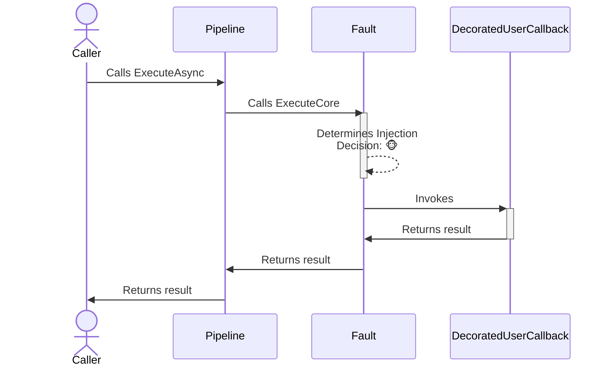
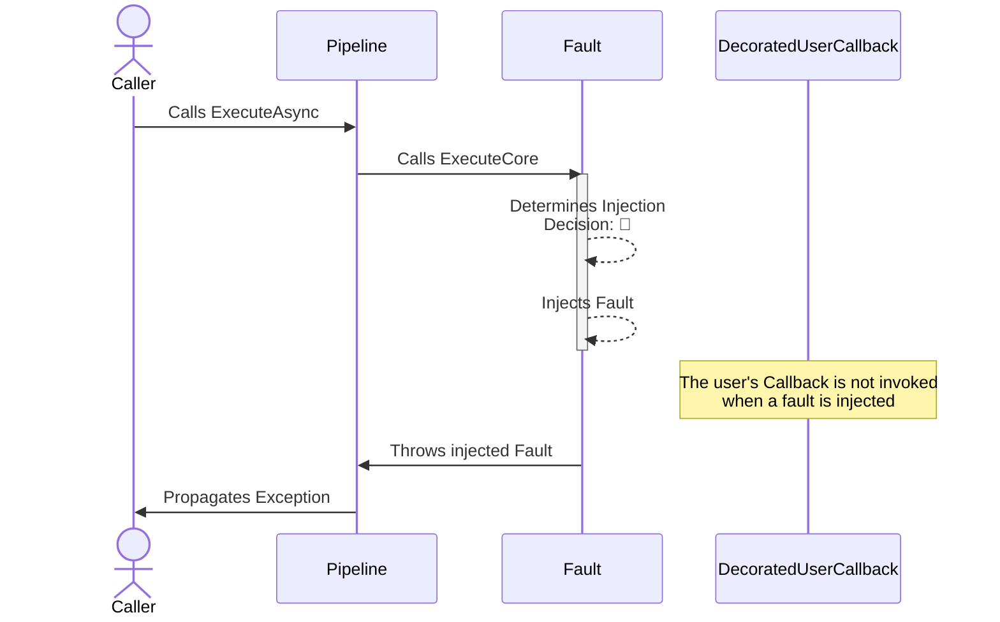

The fault **proactive** chaos strategy is designed to introduce faults (exceptions) into the system, simulating real-world scenarios where operations might fail unexpectedly. It is configurable to inject specific types of exceptions or use custom logic to generate faults dynamically.

## Configuration

- **Options**: `ChaosFaultStrategyOptions`
- **Extensions**: `AddChaosFault`

## Basic usage

Here are several ways to configure the fault chaos strategy:

```csharp
// 10% of invocations will be randomly affected and one of the exceptions will be thrown (equal probability).
var optionsBasic = new ChaosFaultStrategyOptions
{
    FaultGenerator = new FaultGenerator()
        .AddException<InvalidOperationException>() // Uses default constructor
        .AddException(() => new TimeoutException("Chaos timeout injected.")), // Custom exception generator
    InjectionRate = 0.1
};

// To use a custom delegate to generate the fault to be injected
var optionsWithFaultGenerator = new ChaosFaultStrategyOptions
{
    FaultGenerator = static args =>
    {
        Exception? exception = args.Context.OperationKey switch
        {
            "DataLayer" => new TimeoutException(),
            "ApplicationLayer" => new InvalidOperationException(),
            // When the fault generator returns null, the strategy won't inject
            // any fault and just invokes the user's callback.
            _ => null
        };

        return new ValueTask<Exception?>(exception);
    },
    InjectionRate = 0.1
};

// To get notifications when a fault is injected
var optionsOnFaultInjected = new ChaosFaultStrategyOptions
{
    FaultGenerator = new FaultGenerator().AddException<InvalidOperationException>(),
    InjectionRate = 0.1,
    OnFaultInjected = static args =>
    {
        Console.WriteLine("OnFaultInjected, Exception: {0}, Operation: {1}.", args.Fault.Message, args.Context.OperationKey);
        return default;
    }
};

// Add a fault strategy with a ChaosFaultStrategyOptions instance to the pipeline
new ResiliencePipelineBuilder().AddChaosFault(optionsBasic);
new ResiliencePipelineBuilder<HttpResponseMessage>().AddChaosFault(optionsWithFaultGenerator);

// There are also a couple of handy overloads to inject the chaos easily
new ResiliencePipelineBuilder().AddChaosFault(0.1, () => new InvalidOperationException("Dummy exception"));
```

## Complete example

Here's a complete example showing fault injection with retry:

```csharp
var pipeline = new ResiliencePipelineBuilder()
    .AddRetry(new RetryStrategyOptions
    {
        ShouldHandle = new PredicateBuilder().Handle<InvalidOperationException>(),
        BackoffType = DelayBackoffType.Exponential,
        UseJitter = true,  // Adds a random factor to the delay
        MaxRetryAttempts = 4,
        Delay = TimeSpan.FromSeconds(3),
    })
    .AddChaosFault(new ChaosFaultStrategyOptions // Chaos strategies are usually placed as the last ones in the pipeline
    {
        FaultGenerator = static args => new ValueTask<Exception?>(new InvalidOperationException("Dummy exception")),
        InjectionRate = 0.1
    })
    .Build();
```

<Warning>
Chaos strategies should be placed **last** in the resilience pipeline. This ensures that the fault is injected at the last minute, allowing your other resilience strategies (retry, circuit breaker, etc.) to handle the injected fault.
</Warning>

## Strategy options

| Property | Default Value | Description |
|----------|---------------|-------------|
| `FaultGenerator` | `null` | **Required.** This delegate allows you to inject exception by utilizing information that is only available at runtime. |
| `OnFaultInjected` | `null` | If provided then it will be invoked after the fault injection occurred. |

## Generating faults

You have two main approaches to generating faults:

### Using FaultGenerator class

The `FaultGenerator` is a convenience API that allows you to specify what faults (exceptions) are to be injected. Additionally, it also allows assigning weight to each registered fault.

```csharp
new ResiliencePipelineBuilder()
    .AddChaosFault(new ChaosFaultStrategyOptions
    {
        // Use FaultGenerator to register exceptions to be injected
        FaultGenerator = new FaultGenerator()
            .AddException<InvalidOperationException>() // Uses default constructor
            .AddException(() => new TimeoutException("Chaos timeout injected.")) // Custom exception generator
            .AddException(context => CreateExceptionFromContext(context)) // Access the ResilienceContext
            .AddException<TimeoutException>(weight: 50), // Assign weight to the exception, default is 100
    });
```

<Note>
When multiple exceptions are registered with different weights, exceptions with higher weights are more likely to be injected. For example, an exception with weight 50 will be injected half as often as one with weight 100.
</Note>

### Using delegates

Delegates give you the most flexibility at the expense of slightly more complicated syntax. Delegates also support asynchronous fault generation, if you ever need that possibility.

```csharp
new ResiliencePipelineBuilder()
    .AddChaosFault(new ChaosFaultStrategyOptions
    {
        // The same behavior can be achieved with delegates
        FaultGenerator = args =>
        {
            Exception? exception = Random.Shared.Next(350) switch
            {
                < 100 => new InvalidOperationException(),
                < 200 => new TimeoutException("Chaos timeout injected."),
                < 300 => CreateExceptionFromContext(args.Context),
                < 350 => new TimeoutException(),
                _ => null
            };

            return new ValueTask<Exception?>(exception);
        }
    });
```

<Tip>
Returning `null` from the `FaultGenerator` delegate means no fault will be injected for that particular execution, and the user's callback will be invoked normally.
</Tip>

## Telemetry

The fault chaos strategy reports the following telemetry events:

| Event Name | Event Severity | When? |
|------------|----------------|-------|
| `Chaos.OnFault` | `Information` | Just before the strategy calls the `OnFaultInjected` delegate |

Here are some sample events:

```
Resilience event occurred. EventName: 'Chaos.OnFault', Source: '(null)/(null)/Chaos.Fault', Operation Key: '', Result: ''

Resilience event occurred. EventName: 'Chaos.OnFault', Source: 'MyPipeline/MyPipelineInstance/MyChaosFaultStrategy', Operation Key: 'MyFaultInjectedOperation', Result: ''
```

<Note>
The `Chaos.OnFault` telemetry event will be reported **only if** the fault chaos strategy injects an exception which is wrapped into a `ValueTask`. If the fault is either not injected or injected and throws an exception then there will be no telemetry emitted. Also, the `Result` will be **always empty** for the `Chaos.OnFault` telemetry event.
</Note>

## How it works

### Normal execution (no chaos)



### Chaos execution (fault injected)



## Use cases

Fault injection is useful for:

- **Testing error handling**: Verify that your retry, circuit breaker, and fallback strategies work correctly when exceptions occur
- **Simulating external service failures**: Test how your application behaves when dependencies throw exceptions
- **Validating monitoring and alerting**: Ensure your observability systems properly capture and report errors
- **Training operations teams**: Help teams practice incident response procedures in a controlled environment

<Warning>
When using fault injection in production environments, always:
- Start with a very low injection rate (e.g., 0.01 or 1%)
- Target only specific test users or tenants
- Monitor the impact closely
- Have a quick way to disable chaos injection if needed
</Warning>