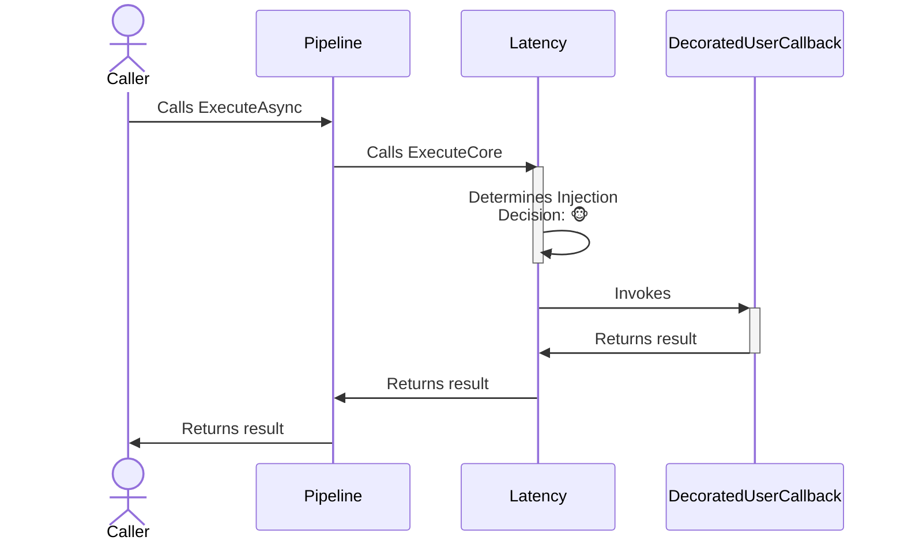
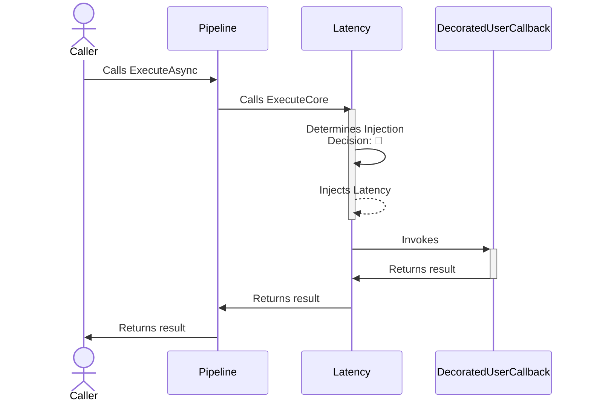

The latency **proactive** chaos strategy is designed to introduce controlled delays into system operations, simulating network latency or slow processing times. This strategy helps in assessing and improving the resilience of applications against increased response times.

## Configuration

- **Options**: `ChaosLatencyStrategyOptions`
- **Extensions**: `AddChaosLatency`

## Basic usage

Here are several ways to configure the latency chaos strategy:

```csharp
// Latency using the default options.
// See defaults section below for default values.
var optionsDefault = new ChaosLatencyStrategyOptions();

// 10% of invocations will be randomly affected
var basicOptions = new ChaosLatencyStrategyOptions
{
    Latency = TimeSpan.FromSeconds(30),
    InjectionRate = 0.1
};

// To use a custom function to generate the latency to inject
var optionsWithLatencyGenerator = new ChaosLatencyStrategyOptions
{
    LatencyGenerator = static args =>
    {
        TimeSpan latency = args.Context.OperationKey switch
        {
            "DataLayer" => TimeSpan.FromMilliseconds(500),
            "ApplicationLayer" => TimeSpan.FromSeconds(2),
            // When the latency generator returns Zero, the strategy
            // won't inject any delay and just invokes the user's callback.
            _ => TimeSpan.Zero
        };

        return new ValueTask<TimeSpan>(latency);
    },
    InjectionRate = 0.1
};

// To get notifications when a delay is injected
var optionsOnLatencyInjected = new ChaosLatencyStrategyOptions
{
    Latency = TimeSpan.FromSeconds(30),
    InjectionRate = 0.1,
    OnLatencyInjected = static args =>
    {
        Console.WriteLine($"OnLatencyInjected, Latency: {args.Latency}, Operation: {args.Context.OperationKey}.");
        return default;
    }
};

// Add a latency strategy with a ChaosLatencyStrategyOptions instance to the pipeline
new ResiliencePipelineBuilder().AddChaosLatency(optionsDefault);
new ResiliencePipelineBuilder<HttpStatusCode>().AddChaosLatency(optionsWithLatencyGenerator);

// There are also a handy overload to inject the chaos easily
new ResiliencePipelineBuilder().AddChaosLatency(0.1, TimeSpan.FromSeconds(30));
```

## Complete example

Here's a complete example showing latency injection with timeout and retry:

```csharp
var pipeline = new ResiliencePipelineBuilder()
    .AddRetry(new RetryStrategyOptions
    {
        ShouldHandle = new PredicateBuilder().Handle<TimeoutRejectedException>(),
        BackoffType = DelayBackoffType.Exponential,
        UseJitter = true,  // Adds a random factor to the delay
        MaxRetryAttempts = 4,
        Delay = TimeSpan.FromSeconds(3),
    })
    .AddTimeout(TimeSpan.FromSeconds(5))
    .AddChaosLatency(new ChaosLatencyStrategyOptions // Chaos strategies are usually placed as the last ones in the pipeline
    {
        Latency = TimeSpan.FromSeconds(10),
        InjectionRate = 0.1
    })
    .Build();
```

<Warning>
Chaos strategies should be placed **last** in the resilience pipeline. This ensures that the latency is injected at the last minute, allowing your other resilience strategies (timeout, retry, etc.) to handle the delayed operations.
</Warning>

## Strategy options

| Property | Default Value | Description |
|----------|---------------|-------------|
| `Latency` | 30 seconds | Defines a **fixed** delay to be injected. |
| `LatencyGenerator` | `null` | This delegate allows you to **dynamically** inject delay by utilizing information that is only available at runtime. |
| `OnLatencyInjected` | `null` | If provided then it will be invoked after the latency injection occurred. |

<Note>
If both `Latency` and `LatencyGenerator` are specified then `Latency` will be ignored.
</Note>

<Warning>
If the calculated latency is negative (regardless if it's fixed or dynamic) then it will not be injected.
</Warning>

## Use cases

Latency injection is useful for:

- **Testing timeout handling**: Verify that your timeout and retry strategies work correctly when operations are slow
- **Simulating network delays**: Test how your application behaves with high network latency
- **Validating user experience**: Ensure your UI remains responsive and provides appropriate feedback during slow operations
- **Performance testing**: Identify bottlenecks and areas where caching or optimization would help
- **Testing distributed systems**: Simulate slow microservices or database queries

## Dynamic latency injection

You can use `LatencyGenerator` to inject different latencies based on context:

```csharp
var options = new ChaosLatencyStrategyOptions
{
    LatencyGenerator = static args =>
    {
        // Different latencies for different operations
        TimeSpan latency = args.Context.OperationKey switch
        {
            "DatabaseQuery" => TimeSpan.FromMilliseconds(500),
            "ExternalAPI" => TimeSpan.FromSeconds(2),
            "FileIO" => TimeSpan.FromMilliseconds(100),
            _ => TimeSpan.Zero // No latency for other operations
        };

        return new ValueTask<TimeSpan>(latency);
    },
    InjectionRate = 0.2
};
```

<Tip>
Returning `TimeSpan.Zero` from the `LatencyGenerator` delegate means no latency will be injected for that particular execution.
</Tip>

## Telemetry

The latency chaos strategy reports the following telemetry events:

| Event Name | Event Severity | When? |
|------------|----------------|-------|
| `Chaos.OnLatency` | `Information` | Just before the strategy calls the `OnLatencyInjected` delegate |

Here are some sample events:

```
Resilience event occurred. EventName: 'Chaos.OnLatency', Source: '(null)/(null)/Chaos.Latency', Operation Key: '', Result: ''

Resilience event occurred. EventName: 'Chaos.OnLatency', Source: 'MyPipeline/MyPipelineInstance/MyLatencyStrategy', Operation Key: 'MyLatencyInjectedOperation', Result: ''
```

<Note>
The `Chaos.OnLatency` telemetry event will be reported **only if** the latency chaos strategy injects a positive delay. If the latency is not injected, or if injected but the latency is negative, or if the `LatencyGenerator` throws an exception, then there will be no telemetry emitted. Also, the `Result` will be **always empty** for the `Chaos.OnLatency` telemetry event.
</Note>

## How it works

### Normal execution (no chaos)



### Chaos execution (latency injected)



<Note>
Unlike fault injection, latency injection does **not** prevent the user's callback from being invoked. The delay is injected **before** the callback is executed.
</Note>

## Best practices

<Warning>
When using latency injection in production environments, always:
- Start with a very low injection rate (e.g., 0.01 or 1%)
- Use realistic latency values (e.g., 100-500ms for network delays, not minutes)
- Target only specific test users or tenants
- Monitor the impact on overall system performance
- Ensure you have proper timeout strategies in place
- Have a quick way to disable chaos injection if needed
</Warning>

<Tip>
Consider combining latency injection with timeout strategies to test how your application handles slow operations. This helps ensure your timeouts are configured appropriately and that your retry logic handles timeout exceptions correctly.
</Tip>