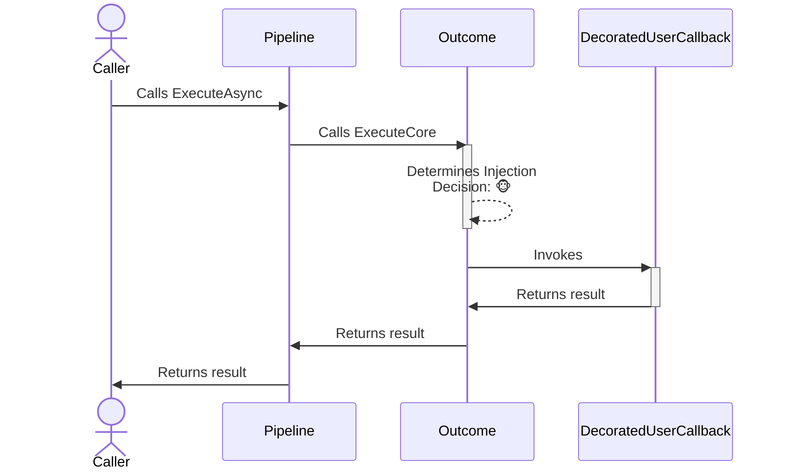
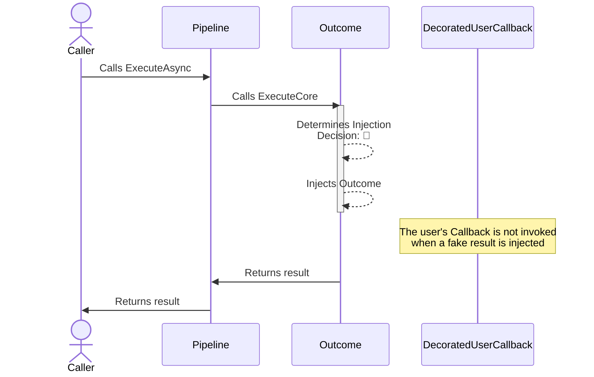

The outcome **reactive** chaos strategy is designed to inject or substitute fake results into system operations. This allows testing how an application behaves when it receives different types of responses, like successful results, errors, or exceptions.

## Configuration

- **Options**: `ChaosOutcomeStrategyOptions<T>`
- **Extensions**: `AddChaosOutcome`

## Basic usage

Here are several ways to configure the outcome chaos strategy:

```csharp
// To use OutcomeGenerator<T> to register the results and exceptions to be injected (equal probability)
var optionsWithResultGenerator = new ChaosOutcomeStrategyOptions<HttpResponseMessage>
{
    OutcomeGenerator = new OutcomeGenerator<HttpResponseMessage>()
        .AddResult(() => new HttpResponseMessage(HttpStatusCode.TooManyRequests))
        .AddResult(() => new HttpResponseMessage(HttpStatusCode.InternalServerError))
        .AddException(() => new HttpRequestException("Chaos request exception.")),
    InjectionRate = 0.1
};

// To get notifications when a result is injected
var optionsOnBehaviorInjected = new ChaosOutcomeStrategyOptions<HttpResponseMessage>
{
    OutcomeGenerator = new OutcomeGenerator<HttpResponseMessage>()
        .AddResult(() => new HttpResponseMessage(HttpStatusCode.InternalServerError)),
    InjectionRate = 0.1,
    OnOutcomeInjected = static args =>
    {
        Console.WriteLine($"OnBehaviorInjected, Outcome: {args.Outcome.Result}, Operation: {args.Context.OperationKey}.");
        return default;
    }
};

// Add a result strategy with a ChaosOutcomeStrategyOptions{<TResult>} instance to the pipeline
new ResiliencePipelineBuilder<HttpResponseMessage>().AddChaosOutcome(optionsWithResultGenerator);
new ResiliencePipelineBuilder<HttpResponseMessage>().AddChaosOutcome(optionsOnBehaviorInjected);

// There are also a couple of handy overloads to inject the chaos easily
new ResiliencePipelineBuilder<HttpResponseMessage>().AddChaosOutcome(0.1, () => new HttpResponseMessage(HttpStatusCode.TooManyRequests));
```

## Complete example

Here's a complete example showing outcome injection with retry:

```csharp
var pipeline = new ResiliencePipelineBuilder<HttpResponseMessage>()
    .AddRetry(new RetryStrategyOptions<HttpResponseMessage>
    {
        ShouldHandle = static args => args.Outcome switch
        {
            { Result.StatusCode: HttpStatusCode.InternalServerError } => PredicateResult.True(),
            _ => PredicateResult.False()
        },
        BackoffType = DelayBackoffType.Exponential,
        UseJitter = true,
        MaxRetryAttempts = 4,
        Delay = TimeSpan.FromSeconds(3),
    })
    .AddChaosOutcome(new ChaosOutcomeStrategyOptions<HttpResponseMessage> // Chaos strategies are usually placed as the last ones in the pipeline
    {
        OutcomeGenerator = static args =>
        {
            var response = new HttpResponseMessage(HttpStatusCode.InternalServerError);
            return ValueTask.FromResult<Outcome<HttpResponseMessage>?>(Outcome.FromResult(response));
        },
        InjectionRate = 0.1
    })
    .Build();
```

<Warning>
Chaos strategies should be placed **last** in the resilience pipeline. This ensures that the fake outcome is injected at the last minute, allowing your other resilience strategies (retry, circuit breaker, etc.) to handle the injected outcome.
</Warning>

## Strategy options

| Property | Default Value | Description |
|----------|---------------|-------------|
| `OutcomeGenerator` | `null` | **Required.** This delegate allows you to inject custom outcome by utilizing information that is only available at runtime. |
| `OnOutcomeInjected` | `null` | If provided then it will be invoked after the outcome injection occurred. |

<Note>
This strategy is a reactive chaos strategy, but it does not have a `ShouldHandle` delegate.
</Note>

## Generating outcomes

You have two main approaches to generating outcomes:

### Using OutcomeGenerator&lt;T&gt; class

The `OutcomeGenerator<T>` is a convenience API that allows you to specify what outcomes (results or exceptions) are to be injected. Additionally, it also allows assigning weight to each registered outcome.

```csharp
new ResiliencePipelineBuilder<HttpResponseMessage>()
    .AddChaosOutcome(new ChaosOutcomeStrategyOptions<HttpResponseMessage>
    {
        // Use OutcomeGenerator<T> to register the results and exceptions to be injected
        OutcomeGenerator = new OutcomeGenerator<HttpResponseMessage>()
            .AddResult(() => new HttpResponseMessage(HttpStatusCode.InternalServerError)) // Result generator
            .AddResult(() => new HttpResponseMessage(HttpStatusCode.TooManyRequests), weight: 50) // Result generator with weight
            .AddResult(context => new HttpResponseMessage(CreateResultFromContext(context))) // Access the ResilienceContext to create result
            .AddException<HttpRequestException>(), // You can also register exceptions
    });
```

<Note>
When multiple outcomes are registered with different weights, outcomes with higher weights are more likely to be injected. For example, an outcome with weight 50 will be injected half as often as one with weight 100.
</Note>

### Using delegates

Delegates give you the most flexibility at the expense of slightly more complicated syntax. Delegates also support asynchronous outcome generation, if you ever need that possibility.

```csharp
new ResiliencePipelineBuilder<HttpResponseMessage>()
    .AddChaosOutcome(new ChaosOutcomeStrategyOptions<HttpResponseMessage>
    {
        // The same behavior can be achieved with delegates
        OutcomeGenerator = static args =>
        {
            Outcome<HttpResponseMessage>? outcome = Random.Shared.Next(350) switch
            {
                < 100 => Outcome.FromResult(new HttpResponseMessage(HttpStatusCode.InternalServerError)),
                < 150 => Outcome.FromResult(new HttpResponseMessage(HttpStatusCode.TooManyRequests)),
                < 250 => Outcome.FromResult(new HttpResponseMessage(CreateResultFromContext(args.Context))),
                < 350 => Outcome.FromException<HttpResponseMessage>(new TimeoutException()),
                _ => Outcome.FromResult(new HttpResponseMessage(HttpStatusCode.OK))
            };

            return ValueTask.FromResult(outcome);
        }
    });
```

## Telemetry

The outcome chaos strategy reports the following telemetry events:

| Event Name | Event Severity | When? |
|------------|----------------|-------|
| `Chaos.OnOutcome` | `Information` | Just before the strategy calls the `OnOutcomeInjected` delegate |

Here are some sample events:

```
Resilience event occurred. EventName: 'Chaos.OnOutcome', Source: '(null)/(null)/Chaos.Outcome', Operation Key: '', Result: ''

Resilience event occurred. EventName: 'Chaos.OnOutcome', Source: 'MyPipeline/MyPipelineInstance/MyOutcomeStrategy', Operation Key: 'MyOutcomeInjectedOperation', Result: ''
```

<Note>
The `Chaos.OnOutcome` telemetry event will be reported **only if** the outcome chaos strategy injects an outcome object. If the outcome is not injected or injected but the generator delegate throws an exception then there will be no telemetry emitted. Also, the `Result` will be **always empty** for the `Chaos.OnOutcome` telemetry event.
</Note>

## How it works

### Normal execution (no chaos)



### Chaos execution (outcome injected)



<Note>
When a fake outcome is injected, the user's callback is **not invoked**. The injected outcome is returned directly.
</Note>

## Use cases

Outcome injection is useful for:

- **Testing error responses**: Verify how your application handles different HTTP status codes or error results
- **Simulating service responses**: Test scenarios where external services return specific responses
- **Testing retry logic**: Ensure your retry strategies correctly handle transient failures
- **Validating circuit breaker behavior**: Test how your circuit breaker opens and closes based on outcomes
- **Testing fallback mechanisms**: Verify that fallback logic activates correctly when certain outcomes occur

## Anti-patterns

### DON'T: Inject only faults using outcome strategy

<Warning>
Don't use outcome strategies to inject only exceptions. Use the fault chaos strategy instead.
</Warning>

```csharp
// ❌ Avoid this
new ResiliencePipelineBuilder<HttpResponseMessage>()
    .AddChaosOutcome(new ChaosOutcomeStrategyOptions<HttpResponseMessage>
    {
        OutcomeGenerator = new OutcomeGenerator<HttpResponseMessage>()
            .AddException<HttpRequestException>(),  // Don't use outcome for only exceptions
    });
```

### DO: Use fault strategy for exceptions

<Tip>
Use the fault strategy to inject exceptions. This provides better telemetry and control.
</Tip>

```csharp
// ✅ Do this instead
new ResiliencePipelineBuilder<HttpResponseMessage>()
    .AddChaosFault(new ChaosFaultStrategyOptions
    {
        FaultGenerator = new FaultGenerator()
            .AddException<HttpRequestException>(),
    });
```

### DON'T: Mix faults and outcomes in advanced scenarios

<Warning>
While you can inject exceptions using the outcome strategy, this has undesired implications:
- Telemetry events mix results and exceptions, making metrics less clear
- You lose separate control over fault vs. outcome injection rates
- Callbacks become more complex as they need to handle both cases
</Warning>

```csharp
// ❌ Avoid mixing in outcome strategy
var pipeline = new ResiliencePipelineBuilder<HttpResponseMessage>()
    .AddChaosOutcome(new ChaosOutcomeStrategyOptions<HttpResponseMessage>
    {
        InjectionRate = 0.5, // Same injection rate for both fault and outcome
        OutcomeGenerator = static args =>
        {
            Outcome<HttpResponseMessage>? outcome = Random.Shared.Next(350) switch
            {
                < 100 => Outcome.FromResult(new HttpResponseMessage(HttpStatusCode.InternalServerError)),
                < 150 => Outcome.FromResult(new HttpResponseMessage(HttpStatusCode.TooManyRequests)),
                < 250 => Outcome.FromResult(new HttpResponseMessage(CreateResultFromContext(args.Context))),
                < 350 => Outcome.FromException<HttpResponseMessage>(new HttpRequestException("Chaos request exception.")), // ⚠️ Avoid this
                _ => Outcome.FromResult(new HttpResponseMessage(HttpStatusCode.OK))
            };

            return ValueTask.FromResult(outcome);
        },
        OnOutcomeInjected = static args =>
        {
            // Complex logic needed to determine what was injected
            if (args.Outcome.Exception != null)
            {
                Console.WriteLine($"Exception: {args.Outcome.Exception.Message}");
            }
            else
            {
                Console.WriteLine($"Outcome: {args.Outcome.Result}");
            }
            return default;
        }
    })
    .Build();
```

### DO: Separate fault and outcome strategies

<Tip>
Separate fault and outcome strategies for better control, clearer telemetry, and more maintainable code.
</Tip>

```csharp
// ✅ Do this instead
var pipeline = new ResiliencePipelineBuilder<HttpResponseMessage>()
    .AddChaosFault(new ChaosFaultStrategyOptions
    {
        InjectionRate = 0.1, // Different injection rate for faults
        EnabledGenerator = static args => ShouldEnableFaults(args.Context),
        FaultGenerator = new FaultGenerator()
            .AddException<HttpRequestException>(),
        OnFaultInjected = static args =>
        {
            Console.WriteLine($"OnFaultInjected, Exception: {args.Fault.Message}");
            return default;
        }
    })
    .AddChaosOutcome(new ChaosOutcomeStrategyOptions<HttpResponseMessage>
    {
        InjectionRate = 0.5, // Different injection rate for outcomes
        EnabledGenerator = static args => ShouldEnableOutcome(args.Context),
        OutcomeGenerator = new OutcomeGenerator<HttpResponseMessage>()
            .AddResult(() => new HttpResponseMessage(HttpStatusCode.InternalServerError))
            .AddResult(() => new HttpResponseMessage(HttpStatusCode.TooManyRequests)),
        OnOutcomeInjected = static args =>
        {
            Console.WriteLine($"OnOutcomeInjected, Outcome: {args.Outcome.Result}");
            return default;
        }
    })
    .Build();
```

## Best practices

<Warning>
When using outcome injection in production environments, always:
- Start with a very low injection rate (e.g., 0.01 or 1%)
- Target only specific test users or tenants
- Use realistic outcomes that could actually occur in production
- Monitor the impact on user experience and system behavior
- Have a quick way to disable chaos injection if needed
</Warning>

<Tip>
Combine outcome injection with retry and circuit breaker strategies to ensure your resilience mechanisms handle different types of responses correctly.
</Tip>