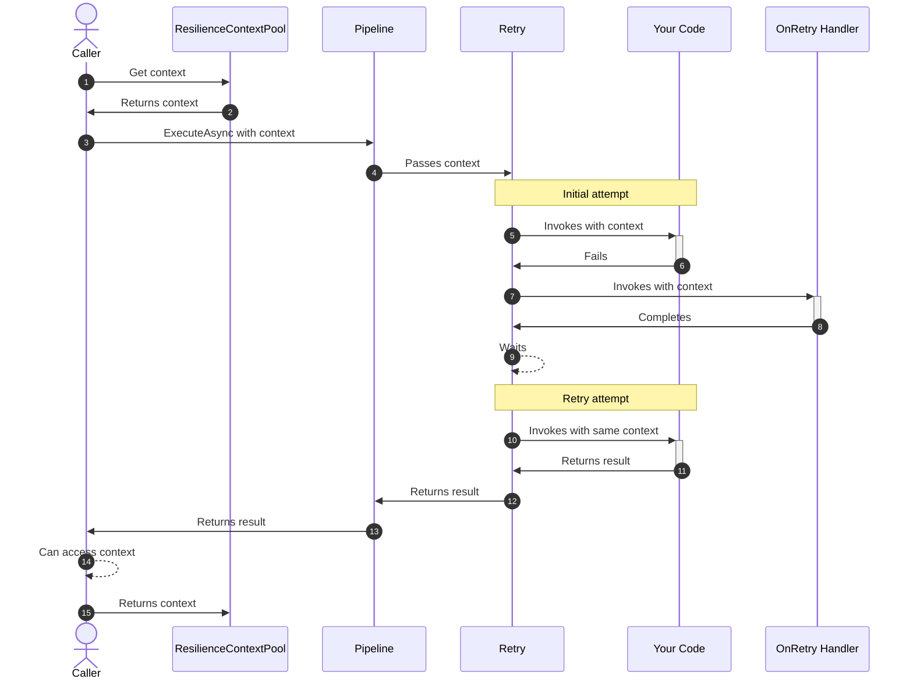

The `ResilienceContext` class provides an execution-scoped instance that accompanies each execution through a Polly resilience pipeline. It enables you to share context and facilitate information exchange between different stages of execution and across multiple strategies.

## What is Resilience Context?

Think of `ResilienceContext` as a backpack that travels with your request through the entire pipeline. It carries important information that strategies and your code can access and modify along the way.

<Info>
The resilience context is shared across all strategies in a pipeline and persists throughout the entire execution, including across retry attempts.
</Info>

## Context Properties

The `ResilienceContext` exposes several key properties:

<CardGroup cols={2}>

<Card title="OperationKey" icon="key">
  A user-defined identifier for the operation, useful for telemetry and logging.
</Card>

<Card title="CancellationToken" icon="stop">
  The cancellation token associated with the operation.
</Card>

<Card title="Properties" icon="database">
  A collection of custom key-value pairs for attaching data to the context.
</Card>

<Card title="ContinueOnCapturedContext" icon="arrows-rotate">
  Controls whether async execution continues on the captured synchronization context.
</Card>

</CardGroup>

## Basic Usage

Here's how to work with `ResilienceContext`:

<Steps>

<Step title="Define resilience property keys">
Create strongly-typed keys for your custom data:

```csharp
public static class MyResilienceKeys
{
    public static readonly ResiliencePropertyKey<string> Key1 = new("my-key-1");
    public static readonly ResiliencePropertyKey<int> Key2 = new("my-key-2");
}
```

<Tip>
Define keys in a static class for easy discovery and maintenance. The `ResiliencePropertyKey<T>` is a lightweight struct-based API.
</Tip>

</Step>

<Step title="Get a context from the pool">
Acquire a context instance from the shared pool:

```csharp
ResilienceContext context = ResilienceContextPool.Shared.Get(cancellationToken);
```

</Step>

<Step title="Attach custom data">
Add your custom data to the context:

```csharp
context.Properties.Set(MyResilienceKeys.Key1, "my-data");
context.Properties.Set(MyResilienceKeys.Key2, 123);
```

</Step>

<Step title="Use the context in your pipeline">
Pass the context when executing the pipeline:

```csharp
ResiliencePipeline pipeline = new ResiliencePipelineBuilder()
    .AddRetry(new()
    {
        OnRetry = static args =>
        {
            // Access custom data from the context
            if (args.Context.Properties.TryGetValue(MyResilienceKeys.Key1, out var data))
            {
                Console.WriteLine("OnRetry, Custom Data: {0}", data);
            }
            return default;
        }
    })
    .Build();

await pipeline.ExecuteAsync(
    static async context =>
    {
        // Your execution logic here
        // You can also access context.Properties here
    },
    context);
```

</Step>

<Step title="Return the context to the pool">
Always return the context to the pool when done:

```csharp
ResilienceContextPool.Shared.Return(context);
```

</Step>

</Steps>

## Complete Example

Here's a complete example showing context usage:

```csharp
using Polly;

public static class MyResilienceKeys
{
    public static readonly ResiliencePropertyKey<string> Key1 = new("my-key-1");
    public static readonly ResiliencePropertyKey<int> Key2 = new("my-key-2");
}

public async Task ExecuteWithContext()
{
    // Retrieve a context with a cancellation token
    ResilienceContext context = ResilienceContextPool.Shared.Get(cancellationToken);

    try
    {
        // Attach custom data to the context
        context.Properties.Set(MyResilienceKeys.Key1, "my-data");
        context.Properties.Set(MyResilienceKeys.Key2, 123);

        // Create pipeline that uses the context
        ResiliencePipeline pipeline = new ResiliencePipelineBuilder()
            .AddRetry(new()
            {
                OnRetry = static args =>
                {
                    // Access context in retry handler
                    if (args.Context.Properties.TryGetValue(MyResilienceKeys.Key1, out var data))
                    {
                        Console.WriteLine("OnRetry, Custom Data: {0}", data);
                    }
                    return default;
                }
            })
            .Build();

        // Execute the pipeline
        await pipeline.ExecuteAsync(
            static async context =>
            {
                // Your execution logic
                await PerformOperationAsync();
            },
            context);
    }
    finally
    {
        // Always return the context to the pool
        ResilienceContextPool.Shared.Return(context);
    }
}
```

## Context Flow Through Pipeline

The context flows through all stages of pipeline execution:



<Note>
The same context instance flows through all retry attempts, allowing you to track state across attempts.
</Note>

## Context Pooling

Creating new `ResilienceContext` instances for each execution would be expensive. Polly provides `ResilienceContextPool` to reuse instances:

### Why Use Pooling?

<CardGroup cols={2}>

<Card title="Reduced Allocations" icon="arrow-down">
  Reusing context instances significantly reduces memory allocations and garbage collection pressure.
</Card>

<Card title="Better Performance" icon="gauge-high">
  Pooling eliminates the overhead of creating and destroying context objects for each execution.
</Card>

</CardGroup>

### Pool Methods

The pool provides several `Get` methods to initialize properties:

```csharp
// Basic: Get with cancellation token
ResilienceContext context = ResilienceContextPool.Shared.Get(cancellationToken);

try
{
    // With operation key
    context = ResilienceContextPool.Shared.Get("my-operation-key", cancellationToken);

    // With all properties
    context = ResilienceContextPool.Shared.Get(
        operationKey: "my-operation-key",
        continueOnCapturedContext: true,
        cancellationToken: cancellationToken);

    // Use the context
    await pipeline.ExecuteAsync(async ctx => { /* ... */ }, context);
}
finally
{
    // Return to pool for reuse
    ResilienceContextPool.Shared.Return(context);
}
```

<Warning>
Always return contexts to the pool when done. However, it's safe to skip returning in exception scenarios if you want to avoid try-catch blocks.
</Warning>

## Common Use Cases

<Accordion title="Tracking correlation IDs">
Use context to pass correlation IDs through your pipeline:

```csharp
public static class CorrelationKeys
{
    public static readonly ResiliencePropertyKey<string> CorrelationId = 
        new("correlation-id");
}

var context = ResilienceContextPool.Shared.Get(cancellationToken);
context.Properties.Set(CorrelationKeys.CorrelationId, Guid.NewGuid().ToString());

var pipeline = new ResiliencePipelineBuilder()
    .AddRetry(new()
    {
        OnRetry = static args =>
        {
            if (args.Context.Properties.TryGetValue(
                CorrelationKeys.CorrelationId, out var correlationId))
            {
                Console.WriteLine($"Retry attempt for correlation: {correlationId}");
            }
            return default;
        }
    })
    .Build();
```
</Accordion>

<Accordion title="Passing request metadata">
Share request-specific metadata across retry attempts:

```csharp
public static class RequestKeys
{
    public static readonly ResiliencePropertyKey<string> UserId = new("user-id");
    public static readonly ResiliencePropertyKey<string> RequestPath = new("request-path");
}

var context = ResilienceContextPool.Shared.Get(cancellationToken);
context.Properties.Set(RequestKeys.UserId, "user-123");
context.Properties.Set(RequestKeys.RequestPath, "/api/orders");

await pipeline.ExecuteAsync(
    static async context =>
    {
        var userId = context.Properties.GetValue(RequestKeys.UserId, "unknown");
        await ProcessRequest(userId);
    },
    context);
```
</Accordion>

<Accordion title="Collecting retry metrics">
Track retry attempts and timing:

```csharp
public static class MetricKeys
{
    public static readonly ResiliencePropertyKey<int> RetryCount = new("retry-count");
    public static readonly ResiliencePropertyKey<TimeSpan> TotalDuration = 
        new("total-duration");
}

var context = ResilienceContextPool.Shared.Get(cancellationToken);
context.Properties.Set(MetricKeys.RetryCount, 0);
var startTime = DateTime.UtcNow;

var pipeline = new ResiliencePipelineBuilder()
    .AddRetry(new()
    {
        OnRetry = static args =>
        {
            var count = args.Context.Properties.GetValue(MetricKeys.RetryCount, 0);
            args.Context.Properties.Set(MetricKeys.RetryCount, count + 1);
            return default;
        }
    })
    .Build();

await pipeline.ExecuteAsync(async ctx => { /* ... */ }, context);

var retries = context.Properties.GetValue(MetricKeys.RetryCount, 0);
var duration = DateTime.UtcNow - startTime;
Console.WriteLine($"Completed after {retries} retries in {duration}");
```
</Accordion>

<Accordion title="Sharing data between strategies">
Pass information from one strategy to another:

```csharp
public static class CircuitBreakerKeys
{
    public static readonly ResiliencePropertyKey<TimeSpan?> SleepDuration = 
        new("sleep-duration");
}

var circuitBreaker = new ResiliencePipelineBuilder()
    .AddCircuitBreaker(new()
    {
        OnOpened = static args =>
        {
            // Share break duration with retry strategy
            args.Context.Properties.Set(
                CircuitBreakerKeys.SleepDuration, 
                args.BreakDuration);
            return ValueTask.CompletedTask;
        },
        OnClosed = args =>
        {
            args.Context.Properties.Set(CircuitBreakerKeys.SleepDuration, null);
            return ValueTask.CompletedTask;
        }
    })
    .Build();

var retry = new ResiliencePipelineBuilder()
    .AddRetry(new()
    {
        DelayGenerator = static args =>
        {
            // Use circuit breaker's break duration if available
            var delay = args.Context.Properties.TryGetValue(
                CircuitBreakerKeys.SleepDuration, out var cbDelay) 
                    ? cbDelay 
                    : TimeSpan.FromSeconds(1);
            return ValueTask.FromResult(delay);
        }
    })
    .Build();
```
</Accordion>

## Operation Key and Telemetry

The `OperationKey` property is particularly important for telemetry:

```csharp
var context = ResilienceContextPool.Shared.Get(
    operationKey: "fetch-user-data",
    cancellationToken: cancellationToken);

await pipeline.ExecuteAsync(async ctx => 
{
    return await userService.GetUserAsync(userId);
}, context);
```

<Warning>
Operation keys are reported in telemetry metrics. Avoid using unbounded values (like user IDs or GUIDs) as operation keys, as this can lead to metric cardinality explosion.
</Warning>

### Good Operation Keys

```csharp
// ✅ Good - bounded set of values
"fetch-user-data"
"update-order"
"send-notification"
"process-payment"
```

### Bad Operation Keys

```csharp
// ❌ Bad - unbounded values
$"fetch-user-{userId}"  // Don't include IDs
$"order-{orderId}"      // Don't include GUIDs  
$"request-{timestamp}"  // Don't include timestamps
```

## Best Practices

<Steps>

<Step title="Always use the context pool">
```csharp
// ✅ Good
var context = ResilienceContextPool.Shared.Get(cancellationToken);
try { /* use context */ }
finally { ResilienceContextPool.Shared.Return(context); }

// ❌ Bad
var context = new ResilienceContext(); // Don't create directly
```
</Step>

<Step title="Define keys in a central location">
```csharp
// ✅ Good - centralized and discoverable
public static class ResilienceKeys
{
    public static readonly ResiliencePropertyKey<string> UserId = new("user-id");
    public static readonly ResiliencePropertyKey<int> RetryCount = new("retry-count");
}

// ❌ Bad - scattered throughout code
var key = new ResiliencePropertyKey<string>("user-id"); // Repeated everywhere
```
</Step>

<Step title="Use typed keys">
```csharp
// ✅ Good - type-safe
public static readonly ResiliencePropertyKey<int> RetryCount = new("retry-count");
context.Properties.Set(RetryCount, 42);

// ❌ Bad - stringly-typed
context.Properties.Set(new ResiliencePropertyKey<object>("retry-count"), "42");
```
</Step>

<Step title="Return contexts in finally blocks">
```csharp
// ✅ Good
var context = ResilienceContextPool.Shared.Get(cancellationToken);
try
{
    await pipeline.ExecuteAsync(async ctx => { /* ... */ }, context);
}
finally
{
    ResilienceContextPool.Shared.Return(context);
}
```
</Step>

</Steps>

## Context vs State Parameter

You might have noticed that some `Execute` methods accept both a `context` and a `state` parameter:

```csharp
await pipeline.ExecuteAsync(
    static async (context, state) =>
    {
        // context: ResilienceContext
        // state: Your custom data
    },
    context,
    state);
```

<CardGroup cols={2}>

<Card title="State Parameter" icon="box">
  **When to use:** Pass parameters to your callback without closures (performance optimization).
  
  **Scope:** Only accessible inside your callback.
  
  **Purpose:** Avoid memory allocations from closures and enable static methods.
</Card>

<Card title="Context Parameter" icon="share-nodes">
  **When to use:** Share information across strategies and retry attempts.
  
  **Scope:** Accessible throughout the entire pipeline execution.
  
  **Purpose:** Exchange data between strategy delegates and execution attempts.
</Card>

</CardGroup>

### Example: State vs Context

```csharp
// Using state for callback parameters (performance)
await pipeline.ExecuteAsync(
    static async (context, state) =>
    {
        await state.httpClient.GetAsync(state.url);
    },
    context,
    (httpClient, url)); // State avoids closure

// Using context for strategy communication
context.Properties.Set(MyKeys.AttemptNumber, 0);
await pipeline.ExecuteAsync(
    static async context =>
    {
        var attempt = context.Properties.GetValue(MyKeys.AttemptNumber, 0);
        // Process...
    },
    context);
```

## Next Steps

<CardGroup cols={2}>

<Card title="Resilience Pipelines" icon="sitemap" href="/concepts/resilience-pipelines">
  Learn how to build and compose resilience pipelines
</Card>

<Card title="Resilience Strategies" icon="shield" href="/concepts/resilience-strategies">
  Explore the available resilience strategies
</Card>

<Card title="Telemetry" icon="chart-line" href="/advanced/telemetry">
  Understand how operation keys are used in telemetry
</Card>

</CardGroup>
