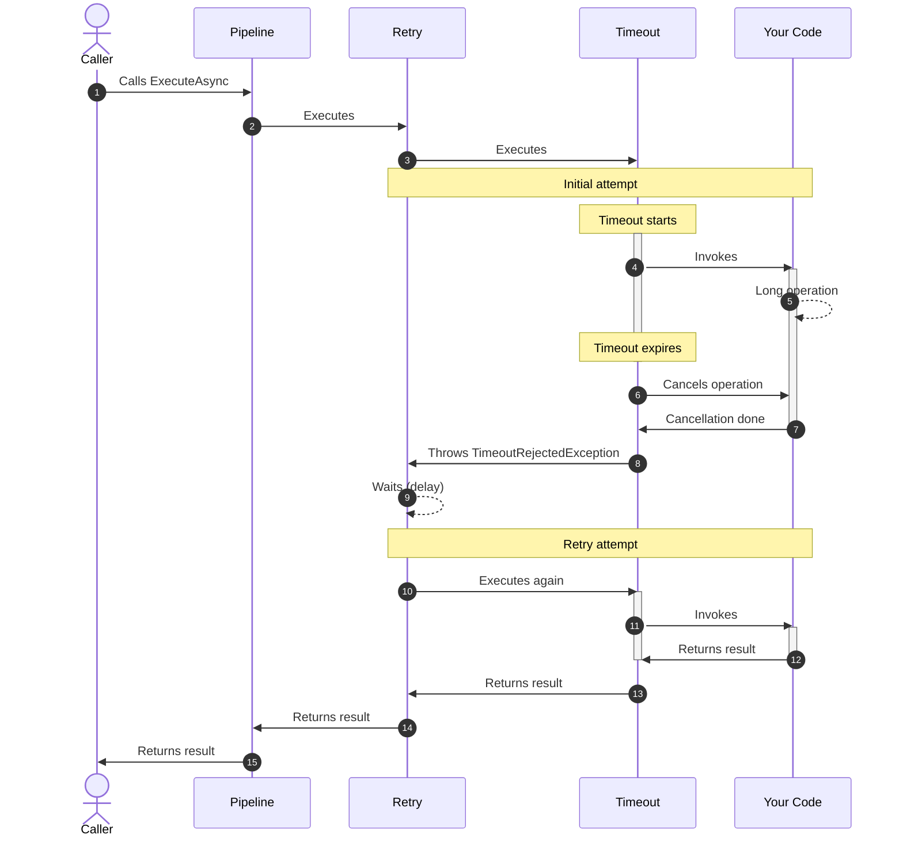

The `ResiliencePipeline` is the foundation of Polly's resilience framework. It allows you to execute arbitrary user-provided callbacks while applying one or more resilience strategies to handle transient faults and failures.

## What is a Resilience Pipeline?

A resilience pipeline is a combination of one or more **resilience strategies** that work together to make your application more fault-tolerant. Think of it as a wrapper around your code that adds layers of protection against failures.

<Info>
A resilience pipeline can contain multiple strategies like retry, circuit breaker, timeout, and rate limiter, all working in harmony to protect your application.
</Info>

## Creating a Resilience Pipeline

You create resilience pipelines using the `ResiliencePipelineBuilder`. Here's a simple example:

```csharp
using Polly;

// Create a pipeline with a concurrency limiter
ResiliencePipeline pipeline = new ResiliencePipelineBuilder()
    .AddConcurrencyLimiter(100)
    .Build();
```

## Executing Code with Pipelines

Once you've built a pipeline, you can execute various types of callbacks:

<Steps>

<Step title="Execute asynchronous void callbacks">

```csharp
await pipeline.ExecuteAsync(
    async token => await MyMethodAsync(token),
    cancellationToken);
```

</Step>

<Step title="Execute synchronous void callbacks">

```csharp
pipeline.Execute(() => MyMethod());
```

</Step>

<Step title="Execute callbacks that return values">

```csharp
var response = await pipeline.ExecuteAsync(
    async token => await httpClient.GetAsync(endpoint, token),
    cancellationToken);
```

</Step>

<Step title="Execute without lambda allocation (performance optimization)">

```csharp
await pipeline.ExecuteAsync(
    static async (state, token) => await state.httpClient.GetAsync(state.endpoint, token),
    (httpClient, endpoint),  // State provided here
    cancellationToken);
```

</Step>

</Steps>

## Dependency Injection Integration

In production applications, you should separate pipeline definition from usage. Polly integrates seamlessly with .NET dependency injection:

```csharp
public static void ConfigureMyPipelines(IServiceCollection services)
{
    services.AddResiliencePipeline("pipeline-A", builder => 
        builder.AddConcurrencyLimiter(100));
    
    services.AddResiliencePipeline("pipeline-B", builder => 
        builder.AddRetry(new()));

    // Later, resolve the pipeline by name
    var pipelineProvider = services.BuildServiceProvider()
        .GetRequiredService<ResiliencePipelineProvider<string>>();
    
    pipelineProvider.GetPipeline("pipeline-A").Execute(() => { });
}
```

<Tip>
Defining pipelines at startup using `AddResiliencePipeline` is the recommended approach for .NET applications. This makes them easily testable and injectable.
</Tip>

## Empty Resilience Pipeline

Polly provides a special empty pipeline that contains no resilience strategies:

```csharp
ResiliencePipeline.Empty
ResiliencePipeline<T>.Empty
```

<Note>
The empty pipeline is particularly useful in test scenarios where implementing resilience strategies could slow down test execution or complicate test setup.
</Note>

## Advanced: Retrieving Results with Outcome

For high-performance scenarios, use `ExecuteOutcomeAsync` to avoid throwing exceptions:

```csharp
// Acquire a ResilienceContext from the pool
ResilienceContext context = ResilienceContextPool.Shared.Get();

// Execute the pipeline and store the result in an Outcome<bool>
Outcome<bool> outcome = await pipeline.ExecuteOutcomeAsync(
    static async (context, state) =>
    {
        Console.WriteLine("State: {0}", state);

        try
        {
            await MyMethodAsync(context.CancellationToken);
            return Outcome.FromResult(true);
        }
        catch (Exception e)
        {
            return Outcome.FromException<bool>(e);
        }
    },
    context,
    "my-state");

// Return the acquired ResilienceContext to the pool
ResilienceContextPool.Shared.Return(context);

// Evaluate the outcome
if (outcome.Exception is not null)
{
    Console.WriteLine("Execution Failed: {0}", outcome.Exception.Message);
}
else
{
    Console.WriteLine("Execution Result: {0}", outcome.Result);
}
```

<Warning>
Use `ExecuteOutcomeAsync` in high-performance scenarios where you need to avoid the overhead of throwing and catching exceptions.
</Warning>

## Context vs State

You might wonder about the difference between `context` and `state` parameters:

<CardGroup cols={2}>

<Card title="State Object" icon="bolt">
  The `state` parameter is a performance optimization that allows you to pass data to your callback without using closures. It's only accessible inside your callback and enables the use of static anonymous methods.
</Card>

<Card title="Context Object" icon="layer-group">
  The `context` parameter is accessible throughout the entire pipeline execution, including in strategy delegates like `ShouldHandle`, `OnRetry`, and `DelayGenerator`. Use it to exchange information between different parts of the pipeline.
</Card>

</CardGroup>

### Rule of Thumb

- **Use `state`** to pass parameters to your decorated method
- **Use `context`** to exchange information between delegates or across retry/hedging attempts

## How Strategies Work Together

When you add multiple strategies to a pipeline, they execute in the order you add them, creating layers of protection:

```csharp
ResiliencePipeline pipeline = new ResiliencePipelineBuilder()
    .AddRetry(new() { 
        ShouldHandle = new PredicateBuilder().Handle<TimeoutRejectedException>() 
    }) // outer
    .AddTimeout(TimeSpan.FromSeconds(1)) // inner
    .Build();
```

### Execution Flow

<Steps>

<Step title="Request enters the pipeline">
The caller invokes `ExecuteAsync` on the pipeline.
</Step>

<Step title="Outer strategies execute first">
The retry strategy (added first) wraps the timeout strategy.
</Step>

<Step title="Inner strategies execute next">
The timeout strategy (added second) wraps your actual code.
</Step>

<Step title="Your code executes">
Your callback runs with all the protection layers active.
</Step>

<Step title="Strategies handle failures">
If a timeout occurs, the timeout strategy throws `TimeoutRejectedException`, which the retry strategy can catch and retry.
</Step>

</Steps>

## Visualizing Pipeline Execution

Here's how a retry strategy wrapping a timeout strategy behaves when the first attempt times out but the second succeeds:



## Best Practices

<Accordion title="Separate pipeline definition from usage">
Define your pipelines at application startup and inject them where needed. This approach facilitates unit testing and makes your code more maintainable.

```csharp
// At startup
services.AddResiliencePipeline("my-pipeline", builder => 
    builder.AddRetry(new()));

// In your service
public class MyService
{
    private readonly ResiliencePipeline _pipeline;
    
    public MyService(ResiliencePipelineProvider<string> provider)
    {
        _pipeline = provider.GetPipeline("my-pipeline");
    }
}
```
</Accordion>

<Accordion title="Order matters when composing strategies">
The order in which you add strategies affects behavior significantly. Generally:
- Add **timeout** around retry to limit total execution time
- Add **retry** around timeout to retry individual attempts that time out
- Add **circuit breaker** on the outside to fail fast when a service is down

```csharp
// Total timeout of 10 seconds, with per-attempt timeout of 1 second
var pipeline = new ResiliencePipelineBuilder()
    .AddTimeout(TimeSpan.FromSeconds(10))  // Total time budget
    .AddRetry(new())                       // Retry logic
    .AddTimeout(TimeSpan.FromSeconds(1))   // Per-attempt timeout
    .Build();
```
</Accordion>

<Accordion title="Use context pooling for performance">
Reuse `ResilienceContext` instances from the pool to reduce allocations:

```csharp
ResilienceContext context = ResilienceContextPool.Shared.Get(cancellationToken);
try
{
    await pipeline.ExecuteAsync(async ctx => { /* your code */ }, context);
}
finally
{
    ResilienceContextPool.Shared.Return(context);
}
```
</Accordion>

## Common Pipeline Patterns

<CodeGroup>

```csharp Retry with timeout per attempt
// Retries up to 3 times, each attempt times out after 1 second
var pipeline = new ResiliencePipelineBuilder()
    .AddRetry(new() { 
        ShouldHandle = new PredicateBuilder()
            .Handle<TimeoutRejectedException>() 
    })
    .AddTimeout(TimeSpan.FromSeconds(1))
    .Build();
```

```csharp Timeout with retry
// Overall timeout of 10 seconds, with retries inside
var pipeline = new ResiliencePipelineBuilder()
    .AddTimeout(TimeSpan.FromSeconds(10))
    .AddRetry(new())
    .Build();
```

```csharp Complete protection
// Circuit breaker + retry + timeout
var pipeline = new ResiliencePipelineBuilder()
    .AddCircuitBreaker(new())
    .AddRetry(new() {
        ShouldHandle = new PredicateBuilder()
            .Handle<TimeoutRejectedException>()
    })
    .AddTimeout(TimeSpan.FromSeconds(5))
    .Build();
```

</CodeGroup>

## Next Steps

<CardGroup cols={2}>

<Card title="Resilience Strategies" icon="shield" href="/concepts/resilience-strategies">
  Learn about the different types of strategies you can add to pipelines
</Card>

<Card title="Resilience Context" icon="database" href="/concepts/resilience-context">
  Understand how to pass data through pipeline execution
</Card>

</CardGroup>
