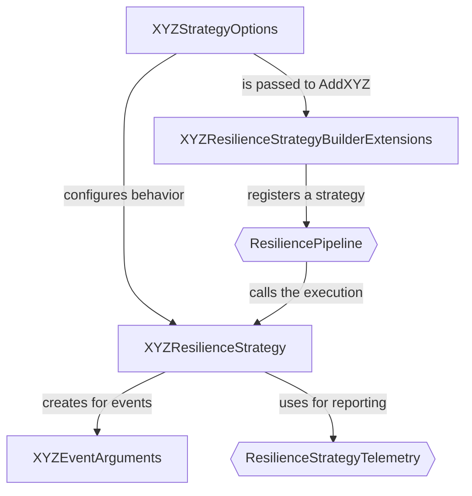

## Introduction

Polly can be extended with custom resilience strategies to meet your specific needs. This guide explains how to create both reactive and proactive resilience strategies.

## Strategy Types

Polly identifies two types of resilience strategies:

<CardGroup cols={2}>
  <Card title="Reactive Strategies" icon="shield-check" href="/extensibility/custom-reactive-strategy">
    Handle specific exceptions or results returned by callbacks
  </Card>
  <Card title="Proactive Strategies" icon="clock" href="/extensibility/custom-proactive-strategy">
    Make proactive decisions to cancel or reject callback execution
  </Card>
</CardGroup>

## Core Components

Every resilience strategy requires these components:

<Steps>
  <Step title="Strategy Implementation">
    The strategy class that inherits from `ResilienceStrategy` or `ResilienceStrategy<T>`
  </Step>
  <Step title="Options Class">
    Configuration options that inherit from `ResilienceStrategyOptions`
  </Step>
  <Step title="Builder Extensions">
    Extension methods for `ResiliencePipelineBuilder` or `ResiliencePipelineBuilder<T>`
  </Step>
  <Step title="Arguments Types">
    Custom structs that encapsulate event information for delegates
  </Step>
</Steps>

## Component Architecture

The diagram below shows how custom components interact with Polly's built-in types:



## Delegates

Resilience strategies use three types of delegates:

### Predicates

Determine whether a strategy should handle a given execution result.

```csharp
Func<Args<TResult>, ValueTask<bool>>
```

### Events

Triggered when significant actions or states occur.

- **Reactive**: `Func<Args<TResult>, ValueTask>`
- **Proactive**: `Func<Args, ValueTask>`

### Generators

Invoked when the strategy needs specific values from the caller.

- **Reactive**: `Func<Args<TResult>, ValueTask<TValue>>`
- **Proactive**: `Func<Args, ValueTask<TValue>>`

<Note>
All delegates are asynchronous and return a `ValueTask`. When setting up delegates, consider using `ResilienceContext.ContinueOnCapturedContext` if your code interacts with a synchronization context.
</Note>

## Delegate Usage Examples

<CodeGroup>

```csharp Non-Generic Pipeline
new ResiliencePipelineBuilder()
    .AddRetry(new RetryStrategyOptions
    {
        // Non-Generic predicate for multiple result types
        ShouldHandle = args => args.Outcome switch
        {
            { Exception: InvalidOperationException } => PredicateResult.True(),
            { Result: string result } when result == "Failure" => PredicateResult.True(),
            { Result: int result } when result == -1 => PredicateResult.True(),
            _ => PredicateResult.False()
        },
    })
    .Build();
```

```csharp Generic Pipeline
new ResiliencePipelineBuilder<string>()
    .AddRetry(new RetryStrategyOptions<string>
    {
        // Generic predicate for a single result type
        ShouldHandle = args => args.Outcome switch
        {
            { Exception: InvalidOperationException } => PredicateResult.True(),
            { Result: { } result } when result == "Failure" => PredicateResult.True(),
            _ => PredicateResult.False()
        },
    })
    .Build();
```

</CodeGroup>

## Arguments

Arguments flow information from the strategy to delegate consumers. They should:

- Always have an `Arguments` suffix
- Include a `Context` property
- Be implemented as readonly structs

### Example: Proactive Arguments

```csharp
public readonly struct OnThresholdExceededArguments
{
    public OnThresholdExceededArguments(ResilienceContext context, TimeSpan threshold, TimeSpan duration)
    {
        Context = context;
        Threshold = threshold;
        Duration = duration;
    }

    public TimeSpan Threshold { get; }

    public TimeSpan Duration { get; }

    // All arguments must provide a Context property
    public ResilienceContext Context { get; }
}
```

<Tip>
Using arguments boosts extensibility and maintainability, as adding new members becomes a non-breaking change.
</Tip>

## Next Steps

<CardGroup cols={2}>
  <Card title="Custom Reactive Strategy" icon="shield-check" href="/extensibility/custom-reactive-strategy">
    Create a strategy that handles specific results or exceptions
  </Card>
  <Card title="Custom Proactive Strategy" icon="clock" href="/extensibility/custom-proactive-strategy">
    Build a strategy that makes proactive execution decisions
  </Card>
</CardGroup>